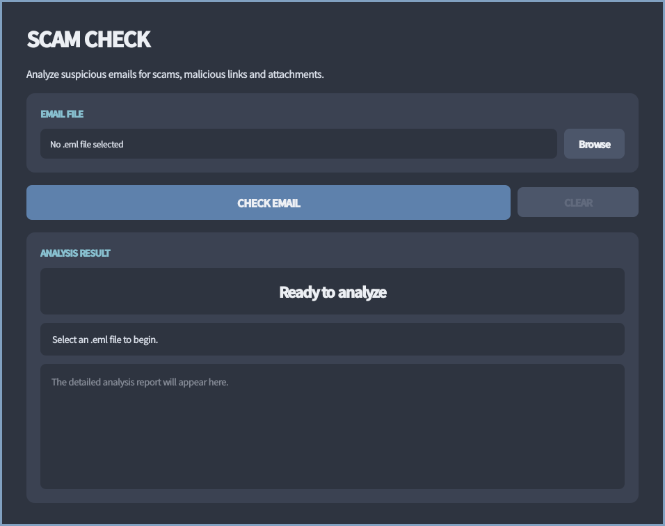
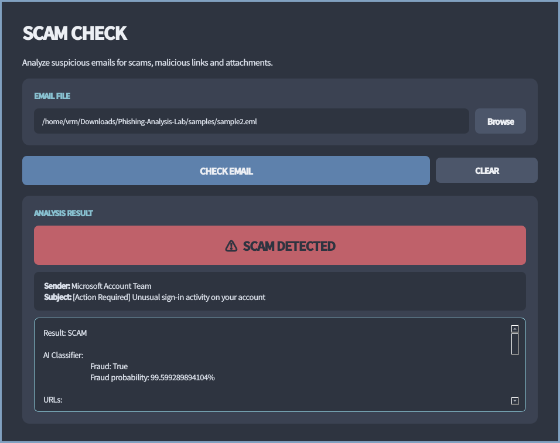
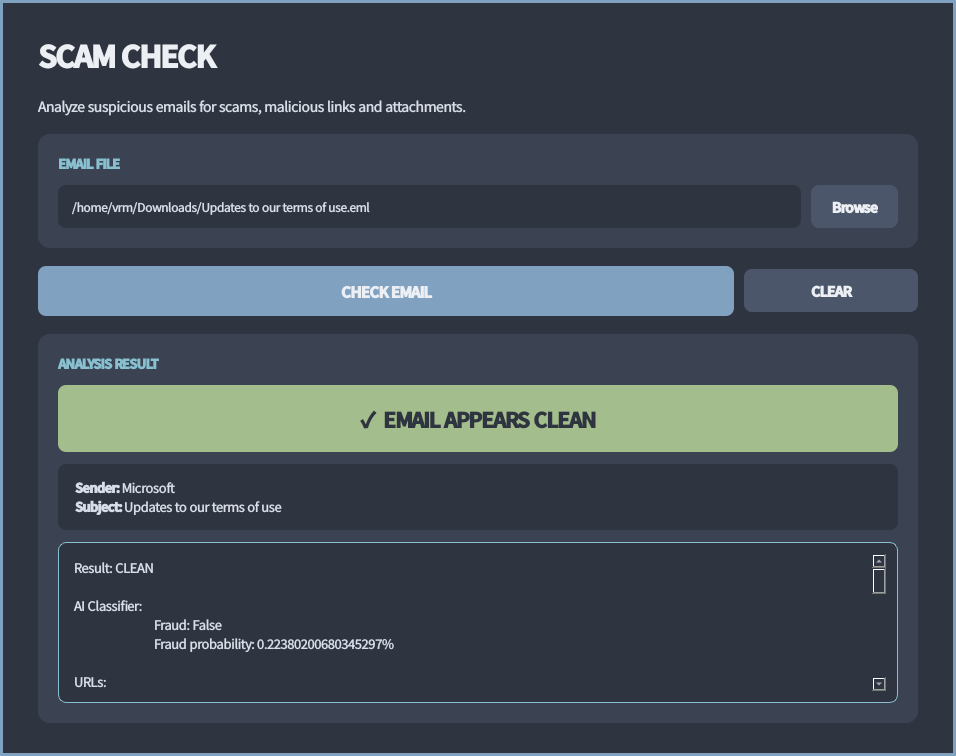

# sck - scam check

SIH internal hackathon

Team: `ballers`

1. [components](#components)
2. [showcase](#showcase)
3. [usage](#usage)

# components

1. `sckd`, the scam check daemon, exposes a single HTTP endpoint `/submit` which
   accepts a base64-encoded RFC-compliant .eml and responds with the report

   ```
   /submit (JSON)

   {
     "content": "<base64-encoded-.eml-file>"
   }
   ```

   ```
   /submit response (JSON)

   {
     "scam": <true|false>,
     "report": "<report-text>"
   }
   ```

   `sckd` checks

   1. the message content using
      [`cunxin/roberta-email-fraud-detector`](https://huggingface.co/cunxin/roberta-email-fraud-detector)
   2. the message links using [VirusTotal](https://virustotal.com)
   3. the message attachments using [ClamAV](https://www.clamav.net/)

2. `sck_cli` and `sck_gui` which can submit arbitrary .eml files to `sckd` at
   `http://$SCKD_ADDRESS:$SCKD_PORT/submit` and displays the report

3. `sck_imapd` which watches an IMAP mailbox for forwarded emails, extracts the
   original .eml and submits to `sckd` at
   `http://$SCKD_ADDRESS:$SCKD_PORT/submit` and sends the report using SMTP

# showcase







# usage

## running `sckd`

### with Nix

1. run `sckd`

   ```console
   $ nix run github:ballers-sih/sck#sckd
   ```

   Make sure to pass `$VT_API_KEY`, either in `.env` or by `export`ing it.

2. `sckd` starts on `127.0.0.1:7079`. this can be changed by passing your own
   `$SCKD_ADDRESS` and `$SCKD_PORT`.

3. ratelimiting and access control for `sckd` is up to the caller. when exposing
   beyond `localhost`, it is recommended to place `sckd` behind a reverse proxy.

### without Nix

1. clone this repo

   ```console
   $ git clone https://github.com/ballers-sih/sck && cd sck
   ```

2. install project

   ```console
   $ pip install -e .
   ```

3. set up environment (RoBERTa model and ClamAV databases)

   ```console
   $ ./shell-hook.sh
   ```

   Make sure `hf`, `clamscan` and `freshclam` are installed and available in
   `PATH`.

4. start sckd

   ```console
   $ sckd
   ```

   Make sure to pass `$VT_API_KEY` (your VirusTotal API Key), either in `.env`
   or by `export`ing it.

5. `sckd` starts on `127.0.0.1:7079`. this can be changed by passing your own
   `$SCKD_ADDRESS` and `$SCKD_PORT`.

6. ratelimiting and access control for `sckd` is up to the caller. when exposing
   beyond `localhost`, it is recommended to place `sckd` behind a reverse proxy.

## running the clients

### with Nix

1. run

   ```console
   $ nix run github:ballers-sih/sck#sck_gui
   ```

   Make sure to pass `$SCKD_ADDRESS` and `$SCKD_PORT`, either in `.env` or by
   `export`ing it.

### without Nix

1. clone this repo

   ```console
   $ git clone https://github.com/ballers-sih/sck && cd sck
   ```

2. install the project

   ```console
   $ pip install -e .
   ```

3. start a client

   ```console
   $ sck_gui
   ```

   Make sure to pass `$SCKD_ADDRESS` and `$SCKD_PORT`, either in a `.env` or by
   `export`ing it.
